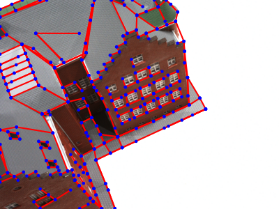
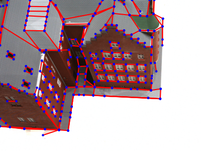
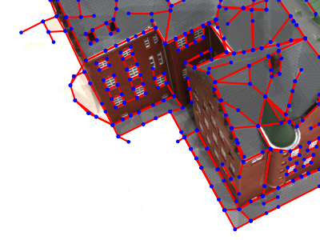
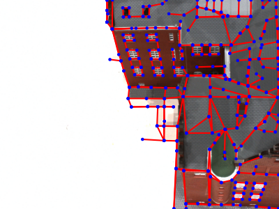
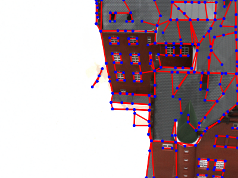
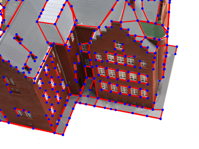
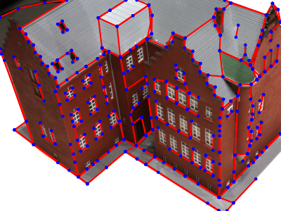

# HAWPv3: Learning Wireframes via Self-Supervised Learning

*The codes of HAWPv2 are placed in the directory of [hawp/fsl](../hawp/fsl).*

|Model Name|Comments|MD5|
|---|---|---|
|[hawpv3-fdc5487a.pth](https://github.com/cherubicXN/hawp-torchhub/releases/download/HAWPv3/hawpv3-fdc5487a.pth)| Trained on the images of Wireframe dataset | fdc5487a43e3d42f6b2addf79d8b930d
|[hawpv3-imagenet-03a84.pth](https://github.com/cherubicXN/hawp-torchhub/releases/download/HAWPv3/hawpv3-imagenet-03a84.pth)| Trained on 100k images of ImageNet dataset| 03a8400e9474320f2b42973d1ba19487|

### Inference on your own images

- Run the following command line to obtain wireframes from HAWPv3 model
    <details>
        <summary><b>hawpv3-fdc5487a.pth</b></summary>
        ```bash
        python -m hawp.ssl.predict --ckpt checkpoints/hawpv3-fdc5487a.pth \
            --threshold 0.05 \
            --img {filename.png}
        ```
    </details>

    <details>
    <summary><b>hawpv3-imagenet-03a84.pth</b></summary>
        ```bash
        python -m hawp.ssl.predict --ckpt checkpoints/hawpv3-imagenet-03a84.pth \
            --threshold 0.05 \
            --img {filename.png}
        ```
    </details>

- A running example on the DTU-24 images
  ```bash
  python -m hawp.ssl.predict --ckpt checkpoints/hawpv3-imagenet-03a84.pth  \
    --threshold 0.05  \
    --img ~/datasets/DTU/scan24/image/*.png \ 
    --saveto docs/figures/dtu-24 --ext png \
  ```
    <p align="center">
    <!-- 
    -->
    
    
    
    
    
    
    
    
    </p>
   
