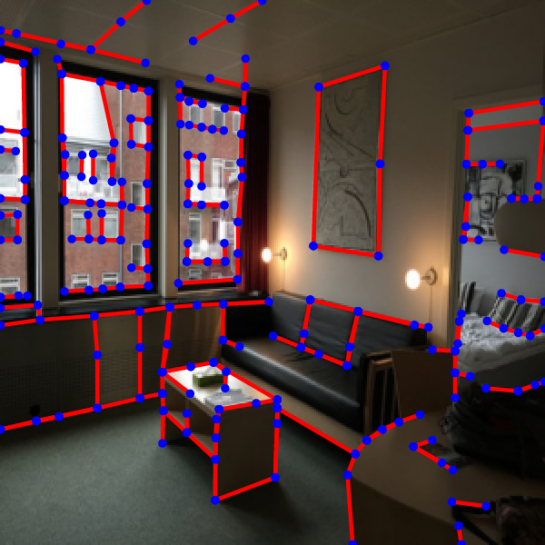
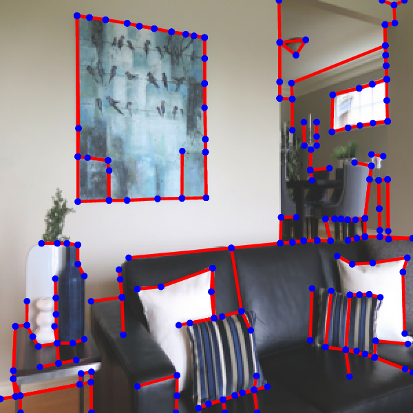
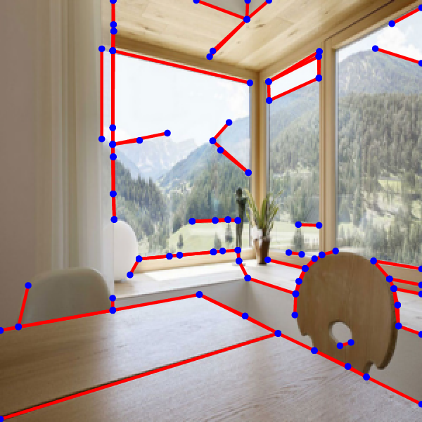
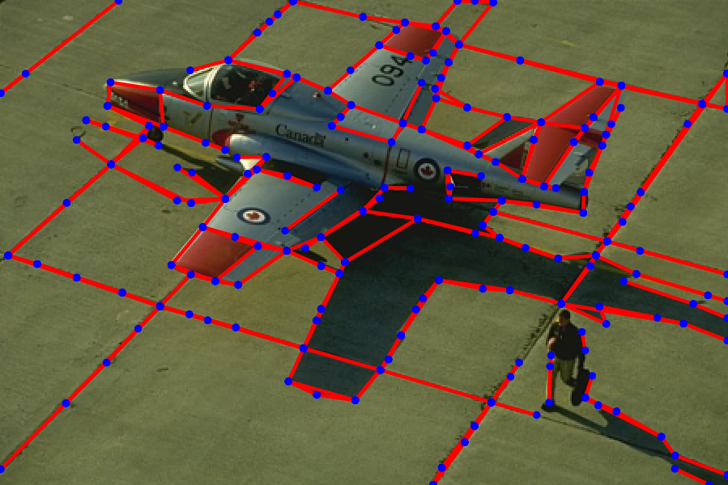
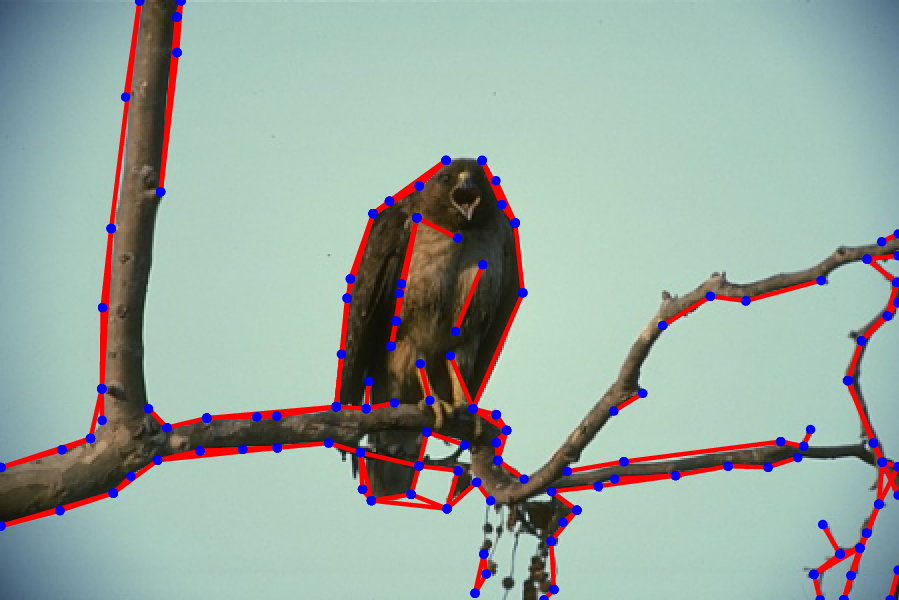
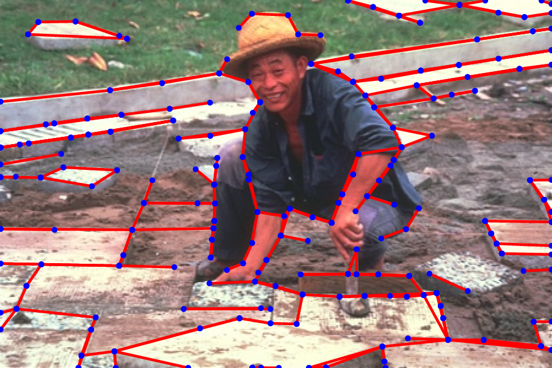
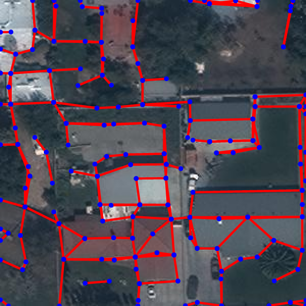
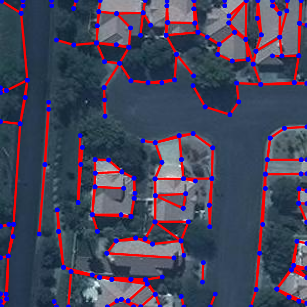

# Holistically-Attracted Wireframe Parsing: From Supervised Learning to Self-Supervised Learning

This is the official implementation of our [paper](https://arxiv.org/abs/2210.12971).

<!-- [**News**] The upgraded HAWPv2 and HAWPv3 are available now! 
[**News**] We experimentally provided an easy-to-install version for inference-only usage of HAWP, please checkout the [``inference``](https://github.com/cherubicXN/hawp/tree/inference) branch for the details. -->

## Highlights

- **HAT Fields**: A General and Robust Representation of Line Segments for Wireframe Parsing
- **HAWPv2**: A state-of-the-art fully-supervised wireframe parser, please checkout [HAWPv2.md](docs/HAWPv2.md) for its details.
- **HAWPv3**: A state-of-the-art self-supervised wireframe parser. Please checkout [HAWPv3.md](docs/HAWPv3.md) for its details. HAWPv3 can be used as a good wireframe parser for the out-of-distribution images.
  
<p align="center">
<!-- 
 -->
 
 
 
</p>
<p align="center">
 
 
 
</p>
<p align="center">
 
 
 
<p>

## Installation 
### Anaconda or Python

- Clone the code repo: ``git clone https://github.com/cherubicXN/hawp.git``.
- Create a conda environment by
```bash
conda create -n hawp python==3.9
conda activate hawp
conda develop .
```
- Run the following command lines to install the dependencies of HAWP
```bash
# Install pytorch, please be careful for the version of CUDA on your machine
pip install torch==1.12.0+cu116 torchvision==0.13.0+cu116 torchaudio==0.12.0 --extra-index-url https://download.pytorch.org/whl/cu116 
# Install other dependencies
pip install -r requirements.txt
```
- Verify the installation.
```bash
python -c "import torch; print(torch.cuda.is_available())" # Check if the installed pytorch supports CUDA.
```
</details>

### Docker
## Citations
If you find our work useful in your research, please consider citing:
```
@article{HAWP-journal,
title = "Holistically-Attracted Wireframe Parsing: From Supervised to Self-Supervised Learning",
author = "Nan Xue and Tianfu Wu and Song Bai and Fu-Dong Wang and Gui-Song Xia and Liangpei Zhang and Philip H.S. Torr
journal = {arXiv:2210.12971},
year = {2022}
}
@inproceedings{HAWP,
title = "Holistically-Attracted Wireframe Parsing",
author = "Nan Xue and Tianfu Wu and Song Bai and Fu-Dong Wang and Gui-Song Xia and Liangpei Zhang and Philip H.S. Torr
",
booktitle = "IEEE Conference on Computer Vision and Pattern Recognition (CVPR)",
year = {2020},
}
```

## Acknowledgment
We acknowledge the effort from the authors of the Wireframe dataset and the YorkUrban dataset. These datasets make accurate line segment detection and wireframe parsing possible. We also thank [Rémi Pautrat](https://rpautrat.github.io/) for helpful discussions.
