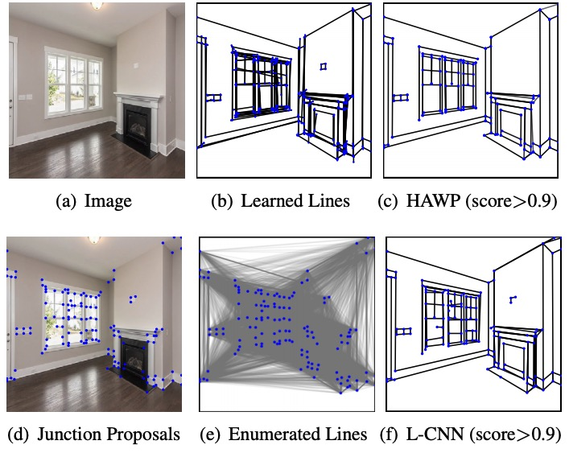
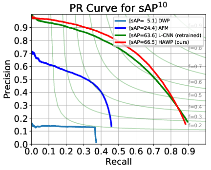
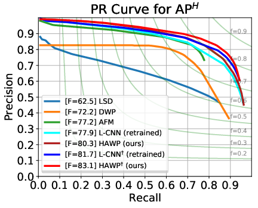
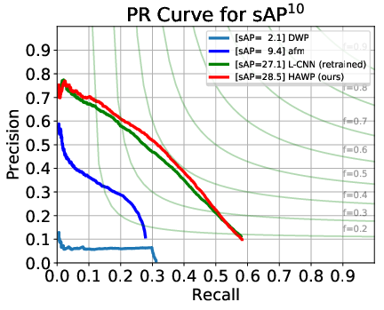
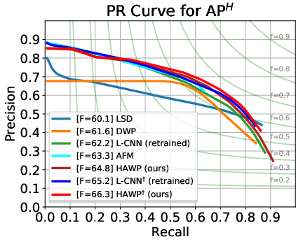

# Holistically-Attracted Wireframe Parsing (CVPR 2020)

This is the official implementation of our [CVPR paper](https://arxiv.org/pdf/2003.01663).

[**News**] We experimentally provided an easy-to-install version for inference-only usage of HAWP, please checkout the [``inference``](https://github.com/cherubicXN/hawp/tree/inference) branch for the details.

## Highlights
- We propose **a fast and parsimonious parsing method HAWP** to accurately and robustly detect a vectorized wireframe in an input image with a single forward pass.
- The proposed HAWP is **fully end-to-end**.
- The proposed HAWP **does not require the squeeze module**.
- **State-of-the-art performance** on the Wireframe dataset and YorkUrban dataset.
- The proposed HAWP achieves **29.5 FPS** on a GPU (Tesla V100) for 1-batch inference.

<p align="center">

<p>

## Quantitative Results

#### Wireframe Dataset

<table style="text-align:center" align="center">
<tr>
    <td rowspan="2" style="text-align:center"> Method </td>
    <td colspan="7" style="text-align:center"> Wireframe Dataset </td>
    <td rowspan="2" style="text-align:center"> FPS </td>
</tr>
<tr >
    <td >sAP<sup>5</sup></td><td>sAP<sup>10</sup></td><td>sAP<sup>15</sup></td>
    <td>msAP</td><td>mAP<sup>J</sup></td><td>AP<sup>H</sup></td><td>F<sup>H</sup></td>
</tr>
<tr>
  <td> LSD</td> <td>/</td> <td>/</td><td>/</td><td>/</td><td>/</td><td>55.2</td><td>62.5</td> <td>49.6</td>
</tr>
<tr>
  <td> AFM</td>
  <td>18.5</td>
  <td>24.4</td>
  <td>27.5</td>
  <td>23.5</td>
  <td>23.3</td>
  <td>69.2</td>
  <td>77.2</td> <td>13.5</td>
</tr>
<tr>
  <td> DWP</td>
  <td>3.7</td>
  <td>5.1</td>
  <td>5.9</td>
  <td>4.9</td>
  <td>40.9</td>
  <td>67.8</td>
  <td>72.2</td> <td>2.24</td>
</tr>
<tr>
  <td rowspan="2"> L-CNN</td>
  <td rowspan="2">58.9</td>
  <td rowspan="2">62.9</td>
  <td rowspan="2">64.9</td>
  <td rowspan="2">62.2</td>
  <td rowspan="2">59.3</td>
  <td>80.3</td>
  <td>76.9</td>
  <td rowspan="2">15.6</td>
</tr>
<tr>
  <td>82.8<sup><span>&#8224;</span></sup>
</td><td>81.3<sup><span>&#8224;</span></sup></td>
</tr>
<tr>
  <td rowspan="2"> L-CNN (re-trained)</td>
  <td rowspan="2">59.7</td>
  <td rowspan="2">63.6</td>
  <td rowspan="2">65.3</td>
  <td rowspan="2">62.9</td>
  <td rowspan="2">60.2</td>
  <td>81.6</td>
  <td>77.9</td>
  <td rowspan="2">15.6</td>
</tr>
<tr>
  <td>83.7<sup><span>&#8224;</span></sup>
</td><td>81.7<sup><span>&#8224;</span></sup></td>
</tr>
<tr>
  <td rowspan="2"> <b>HAWP (Ours)</b></td>
  <td rowspan="2"><b>62.5</b></td>
  <td rowspan="2"><b>66.5</b></td>
  <td rowspan="2"><b>68.2</b></td>
  <td rowspan="2"><b>65.7</b></td>
  <td rowspan="2"><b>60.2</b></td>
  <td><b>84.5</b></td>
  <td><b>80.3</b></td>
  <td rowspan="2">29.5</td>
</tr>
<tr>
  <td><b>86.1</b><sup><span>&#8224;</span></sup>
</td><td><b>83.1</b><sup><span>&#8224;</span></sup></td>
</tr>
</table>


<p align="left">


</p>


#### YorkUrban Dataset
<p align="center">
<table style="text-align:center">
<tr>
    <td rowspan="2" style="text-align:center"> Method </td>
    <td colspan="7" style="text-align:center"> YorkUrban Dataset </td>
    <td rowspan="2" style="text-align:center"> FPS </td>
</tr>
<tr >
    <td >sAP<sup>5</sup></td><td>sAP<sup>10</sup></td><td>sAP<sup>15</sup></td>
    <td>msAP</td><td>mAP<sup>J</sup></td><td>AP<sup>H</sup></td><td>F<sup>H</sup></td>
</tr>
<tr>
  <td> LSD</td> <td>/</td> <td>/</td><td>/</td><td>/</td><td>/</td><td>50.9</td><td>60.1</td> <td>49.6</td>
</tr>
<tr>
  <td> AFM</td>
  <td>7.3</td>
  <td>9.4</td>
  <td>11.1</td>
  <td>9.3</td>
  <td>12.4</td>
  <td>48.2</td>
  <td>63.3</td> <td>13.5</td>
</tr>
<tr>
  <td> DWP</td>
  <td>1.5</td>
  <td>2.1</td>
  <td>2.6</td>
  <td>2.1</td>
  <td>13.4</td>
  <td>51.0</td>
  <td>61.6</td> <td>2.24</td>
</tr>
<tr>
  <td rowspan="2"> L-CNN</td>
  <td rowspan="2">24.3</td>
  <td rowspan="2">26.4</td>
  <td rowspan="2">27.5</td>
  <td rowspan="2">26.1</td>
  <td rowspan="2">30.4</td>
  <td>58.5</td>
  <td>61.8</td>
  <td rowspan="2">15.6</td>
</tr>
<tr>
  <td>59.6<sup><span>&#8224;</span></sup>
</td><td>65.3<sup><span>&#8224;</span></sup></td>
</tr>
<tr>
  <td rowspan="2"> L-CNN (re-trained)</td>
  <td rowspan="2">25.0</td>
  <td rowspan="2">27.1</td>
  <td rowspan="2">28.3</td>
  <td rowspan="2">26.8</td>
  <td rowspan="2">31.5</td>
  <td>58.3</td>
  <td>62.2</td>
  <td rowspan="2">15.6</td>
</tr>
<tr>
  <td>59.3<sup><span>&#8224;</span></sup>
</td><td>65.2<sup><span>&#8224;</span></sup></td>
</tr>
<tr>
  <td rowspan="2"> <b>HAWP (Ours)</b></td>
  <td rowspan="2"><b>26.1</b></td>
  <td rowspan="2"><b>28.5</b></td>
  <td rowspan="2"><b>29.7</b></td>
  <td rowspan="2"><b>28.1</b></td>
  <td rowspan="2"><b>31.6</b></td>
  <td><b>60.6</b></td>
  <td><b>64.8</b></td>
  <td rowspan="2">29.5</td>
</tr>
<tr>
  <td><b>61.2</b><sup><span>&#8224;</span></sup>
</td><td><b>66.3</b><sup><span>&#8224;</span></sup></td>
</tr>
</table>
</p>


<p align="left">


<p>

## Installation (tested on Ubuntu-18.04, CUDA 10.0, GCC 7.4.0)
```shell
conda create -n hawp python=3.6
conda install pytorch torchvision cudatoolkit=10.0 -c pytorch

cd hawp
conda develop .

pip install -r requirement.txt
python setup.py build_ext --inplace
```

## Quickstart with the pretrained model 

```shell
python scripts/predict.py --img figures/example.png
```

## Training & Testing
### Data Preparation
- Download the [Wireframe dataset](https://github.com/huangkuns/wireframe) and the [YorkUrban dataset](http://www.elderlab.yorku.ca/resources/york-urban-line-segment-database-information/) from their project pages.
- Download the JSON-format annotations ([Google Drive](https://drive.google.com/file/d/18totta2M57jqOuimusI041SlIvYDSmZb/view?usp=sharing)).
- Place the images to "hawp/data/wireframe/images/" and "hawp/data/york/images/".
- Unzip the json-format annotations to "hawp/data/wireframe" and "hawp/data/york".

The structure of the data folder should be
```shell
data/
   wireframe/images/*.png
   wireframe/train.json
   wireframe/test.json
   ------------------------
   york/images/*.png
   york/test.json
```
### Training
```shell
CUDA_VISIBLE_DEVICES=0, python scripts/train.py --config-file config-files/hawp.yaml
```
The best model is manually selected from the model files after 25 epochs.
### Testing
```shell
CUDA_VISIBLE_DEVICES=0, python scripts/test.py --config-file config-files/hawp.yaml [optional] --display
```
The output results will be saved to OUTPUT_DIR/$dataset_name.json. The dataset_name should be wireframe_test or york_test.

### Structural-AP Evaluation
- Run scripts/test.py to get the wireframe parsing results.
- Run scripts/eval_sap.py to get the sAP results
```shell
# example on the Wireframe dataset
python scripts/eval_sap.py --path outputs/hawp/wireframe_test.json --threshold 10
```

## Citations
If you find our work useful in your research, please consider citing:
```
@inproceedings{HAWP,
title = "Holistically-Attracted Wireframe Parsing",
author = "Nan Xue and Tianfu Wu and Song Bai and Fu-Dong Wang and Gui-Song Xia and Liangpei Zhang and Philip H.S. Torr
",
booktitle = "IEEE Conference on Computer Vision and Pattern Recognition (CVPR)",
year = {2020},
}
```

## Acknowledgment
We acknowledge the effort from the authors of the Wireframe dataset and the YorkUrban dataset. These datasets make accurate line segment detection and wireframe parsing possible.
